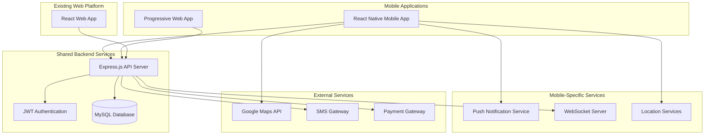
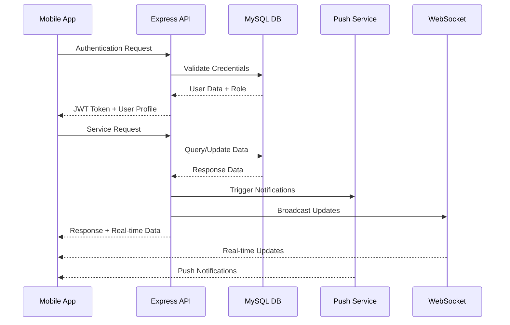

# Design Document

## Overview

The OMW Progressive Mobile Application will be built as a React Native application using Expo, leveraging the existing React.js frontend expertise and seamlessly integrating with the current Node.js/Express backend infrastructure. The mobile app will maintain full compatibility with the existing API endpoints while providing enhanced mobile-specific features such as push notifications, offline capabilities, real-time location tracking, and native device integrations.

The design follows a hybrid approach where the mobile app acts as an enhanced client to the existing backend services, preserving all current business logic, authentication mechanisms, and data structures while optimizing the user experience for mobile devices.

## Architecture

### High-Level Architecture



### Technology Stack Integration

**Frontend Mobile Stack:**
- **Framework**: React Native with Expo SDK 50+
- **Navigation**: React Navigation 6 (similar to React Router DOM patterns)
- **State Management**: Zustand (reusing existing store patterns)
- **HTTP Client**: Axios (same configuration as web app)
- **UI Components**: React Native Elements + Custom components adapted from web
- **Maps**: React Native Maps with Google Maps integration
- **Notifications**: Expo Notifications + Firebase Cloud Messaging
- **Offline Storage**: AsyncStorage + SQLite for complex data

**Backend Extensions:**
- **Real-time Communication**: Socket.io integration with existing Express server
- **Push Notifications**: Firebase Admin SDK for server-side push notifications
- **WebSocket Support**: Socket.io server middleware for real-time features
- **Mobile API Optimizations**: Response compression and mobile-specific endpoints

### Data Flow Architecture



## Components and Interfaces

### Mobile App Component Architecture

```
src/
├── components/
│   ├── common/
│   │   ├── Button.jsx (adapted from web)
│   │   ├── Input.jsx (mobile-optimized)
│   │   ├── LoadingSpinner.jsx
│   │   └── Toast.jsx (React Native compatible)
│   ├── navigation/
│   │   ├── TabNavigator.jsx
│   │   ├── StackNavigator.jsx
│   │   └── DrawerNavigator.jsx
│   ├── maps/
│   │   ├── LocationPicker.jsx
│   │   ├── LiveTracking.jsx
│   │   └── RouteDisplay.jsx
│   └── role-specific/
│       ├── customer/
│       ├── worker/
│       ├── admin/
│       └── driver/
├── screens/
│   ├── auth/
│   │   ├── LoginScreen.jsx
│   │   ├── RegisterScreen.jsx
│   │   └── ForgotPasswordScreen.jsx
│   ├── customer/
│   │   ├── HomeScreen.jsx
│   │   ├── ServiceCatalogScreen.jsx
│   │   ├── BookingScreen.jsx
│   │   ├── TrackingScreen.jsx
│   │   └── ProfileScreen.jsx
│   ├── worker/
│   │   ├── DashboardScreen.jsx
│   │   ├── JobsScreen.jsx
│   │   ├── ScheduleScreen.jsx
│   │   └── EarningsScreen.jsx
│   ├── admin/
│   │   ├── AdminDashboardScreen.jsx
│   │   ├── UserManagementScreen.jsx
│   │   └── DisputeScreen.jsx
│   └── shared/
│       ├── NotificationsScreen.jsx
│       ├── SettingsScreen.jsx
│       └── HelpScreen.jsx
├── services/
│   ├── api/
│   │   ├── authService.js (adapted from web)
│   │   ├── customerService.js
│   │   ├── workerService.js
│   │   ├── adminService.js
│   │   └── locationService.js
│   ├── storage/
│   │   ├── secureStorage.js
│   │   ├── cacheManager.js
│   │   └── offlineQueue.js
│   ├── notifications/
│   │   ├── pushNotifications.js
│   │   └── localNotifications.js
│   └── location/
│       ├── gpsService.js
│       ├── geocoding.js
│       └── navigation.js
├── stores/
│   ├── authStore.js (Zustand - adapted from web)
│   ├── cartStore.js (Zustand - adapted from web)
│   ├── locationStore.js
│   └── notificationStore.js
├── utils/
│   ├── constants.js
│   ├── helpers.js
│   ├── validators.js (reused from web)
│   └── permissions.js
└── hooks/
    ├── useAuth.js (adapted from web)
    ├── useLocation.js
    ├── useNotifications.js
    └── useOfflineSync.js
```

### API Integration Layer

**Existing API Endpoints (No Changes Required):**
- `/api/auth/*` - Authentication endpoints
- `/api/customer/*` - Customer management
- `/api/worker-management/*` - Worker operations
- `/api/admin/*` - Admin functions
- `/api/superadmin/*` - Super admin operations
- `/api/categories/*` - Service categories
- `/api/customer/cart/*` - Cart management
- `/api/customer/addresses/*` - Address management
- `/api/customer/bookings/*` - Booking operations
- `/api/customer/driver/*` - Driver booking services

**New Mobile-Specific API Extensions:**
```javascript
// Mobile-specific endpoints to be added
app.use(`${baseURL}/mobile/notifications`, notificationRoute);
app.use(`${baseURL}/mobile/location`, locationRoute);
app.use(`${baseURL}/mobile/sync`, syncRoute);
app.use(`${baseURL}/mobile/device`, deviceRoute);
```

### Real-time Communication Interface

**WebSocket Integration:**
```javascript
// Socket.io integration with existing Express server
const { Server } = require('socket.io');
const io = new Server(server, {
  cors: {
    origin: process.env.FRONTEND_URL,
    methods: ["GET", "POST"]
  }
});

// Role-based socket rooms
io.on('connection', (socket) => {
  socket.on('join-role-room', (data) => {
    const { userId, role } = data;
    socket.join(`${role}-${userId}`);
  });
  
  socket.on('location-update', (data) => {
    // Broadcast to relevant users
    socket.to(`customer-${data.customerId}`).emit('driver-location', data);
  });
});
```

## Role-Specific Mobile Architecture

### Multi-Role User Management
```javascript
// Enhanced role switching architecture
const RoleManager = {
  supportedRoles: ['customer', 'worker', 'driver', 'admin', 'superadmin'],
  
  switchRole: (userId, targetRole) => {
    // Validate user has access to target role
    // Clear role-specific cache
    // Update navigation stack
    // Refresh permissions
  },
  
  getRoleSpecificNavigation: (role) => {
    switch(role) {
      case 'customer': return CustomerTabNavigator;
      case 'worker': return WorkerTabNavigator;
      case 'driver': return DriverTabNavigator;
      case 'admin': return AdminStackNavigator;
      case 'superadmin': return SuperAdminStackNavigator;
    }
  }
};
```

### Driver-Specific Mobile Components
```
src/screens/driver/
├── DriverDashboardScreen.jsx
├── RideRequestsScreen.jsx
├── ActiveRideScreen.jsx
├── NavigationScreen.jsx
├── EarningsScreen.jsx
└── VehicleManagementScreen.jsx

src/components/driver/
├── RideRequestCard.jsx
├── LiveTrackingMap.jsx
├── TripStatusIndicator.jsx
├── NavigationControls.jsx
└── EarningsChart.jsx
```

### Super Admin Mobile Interface
```
src/screens/superadmin/
├── SystemHealthScreen.jsx
├── AdminManagementScreen.jsx
├── PlatformAnalyticsScreen.jsx
├── SystemConfigScreen.jsx
├── AuditLogsScreen.jsx
└── EmergencyControlsScreen.jsx
```

## Enhanced Backend Integration

### Database Schema Extensions

**Device Management:**
```sql
-- Device registration and management
CREATE TABLE device_registrations (
  id INT PRIMARY KEY AUTO_INCREMENT,
  user_id INT NOT NULL,
  device_token VARCHAR(255) UNIQUE,
  platform ENUM('ios', 'android', 'web') NOT NULL,
  app_version VARCHAR(50),
  device_model VARCHAR(100),
  os_version VARCHAR(50),
  last_active TIMESTAMP DEFAULT CURRENT_TIMESTAMP,
  notification_preferences JSON,
  is_active BOOLEAN DEFAULT TRUE,
  created_at TIMESTAMP DEFAULT CURRENT_TIMESTAMP,
  updated_at TIMESTAMP DEFAULT CURRENT_TIMESTAMP ON UPDATE CURRENT_TIMESTAMP,
  FOREIGN KEY (user_id) REFERENCES users(id) ON DELETE CASCADE,
  INDEX idx_user_device (user_id, platform),
  INDEX idx_device_token (device_token)
);

-- Enhanced location tracking
CREATE TABLE location_tracking (
  id INT PRIMARY KEY AUTO_INCREMENT,
  user_id INT NOT NULL,
  booking_id INT,
  ride_id INT,
  latitude DECIMAL(10,8) NOT NULL,
  longitude DECIMAL(11,8) NOT NULL,
  accuracy FLOAT,
  altitude FLOAT,
  speed FLOAT,
  heading FLOAT,
  timestamp TIMESTAMP DEFAULT CURRENT_TIMESTAMP,
  location_type ENUM('gps', 'network', 'passive') DEFAULT 'gps',
  is_active BOOLEAN DEFAULT TRUE,
  battery_level INT,
  FOREIGN KEY (user_id) REFERENCES users(id) ON DELETE CASCADE,
  FOREIGN KEY (booking_id) REFERENCES bookings(id) ON DELETE SET NULL,
  INDEX idx_user_tracking (user_id, timestamp),
  INDEX idx_booking_tracking (booking_id, timestamp),
  SPATIAL INDEX idx_location (latitude, longitude)
);

-- Offline action queue
CREATE TABLE offline_queue (
  id INT PRIMARY KEY AUTO_INCREMENT,
  user_id INT NOT NULL,
  device_id VARCHAR(255),
  action_type VARCHAR(100) NOT NULL,
  endpoint VARCHAR(255) NOT NULL,
  http_method ENUM('GET', 'POST', 'PUT', 'DELETE', 'PATCH') NOT NULL,
  payload JSON,
  headers JSON,
  created_at TIMESTAMP DEFAULT CURRENT_TIMESTAMP,
  retry_count INT DEFAULT 0,
  max_retries INT DEFAULT 3,
  status ENUM('pending', 'processing', 'completed', 'failed') DEFAULT 'pending',
  error_message TEXT,
  completed_at TIMESTAMP NULL,
  FOREIGN KEY (user_id) REFERENCES users(id) ON DELETE CASCADE,
  INDEX idx_user_queue (user_id, status),
  INDEX idx_status_created (status, created_at)
);

-- Push notification logs
CREATE TABLE notification_logs (
  id INT PRIMARY KEY AUTO_INCREMENT,
  user_id INT NOT NULL,
  device_token VARCHAR(255),
  notification_type VARCHAR(100),
  title VARCHAR(255),
  body TEXT,
  data JSON,
  sent_at TIMESTAMP DEFAULT CURRENT_TIMESTAMP,
  delivery_status ENUM('sent', 'delivered', 'failed', 'clicked') DEFAULT 'sent',
  error_message TEXT,
  FOREIGN KEY (user_id) REFERENCES users(id) ON DELETE CASCADE,
  INDEX idx_user_notifications (user_id, sent_at),
  INDEX idx_delivery_status (delivery_status, sent_at)
);
```

### Enhanced API Endpoints

**Mobile-Specific API Extensions:**
```javascript
// Enhanced mobile API routes
const mobileRoutes = {
  // Device management
  'POST /api/mobile/device/register': 'Register device for push notifications',
  'PUT /api/mobile/device/update': 'Update device information',
  'DELETE /api/mobile/device/unregister': 'Remove device registration',
  
  // Location services
  'POST /api/mobile/location/update': 'Update user location',
  'GET /api/mobile/location/nearby': 'Find nearby services/workers',
  'POST /api/mobile/location/track': 'Start location tracking session',
  'DELETE /api/mobile/location/track/:sessionId': 'Stop tracking session',
  
  // Offline synchronization
  'POST /api/mobile/sync/queue': 'Submit offline actions queue',
  'GET /api/mobile/sync/status': 'Get sync status',
  'POST /api/mobile/sync/resolve-conflicts': 'Resolve data conflicts',
  
  // Push notifications
  'POST /api/mobile/notifications/send': 'Send push notification',
  'GET /api/mobile/notifications/history': 'Get notification history',
  'PUT /api/mobile/notifications/preferences': 'Update notification settings',
  
  // Mobile-optimized data endpoints
  'GET /api/mobile/dashboard/summary': 'Get condensed dashboard data',
  'GET /api/mobile/bookings/active': 'Get active bookings only',
  'GET /api/mobile/profile/minimal': 'Get essential profile data'
};
```

## Security Implementation

### Data Encryption Strategy
```javascript
// Enhanced security implementation
const SecurityManager = {
  // Sensitive data encryption
  encryptSensitiveData: (data) => {
    // Use AES-256-GCM for sensitive data
    // Implement key rotation strategy
    // Store encryption keys in secure keychain
  },
  
  // Biometric authentication
  biometricAuth: {
    setup: () => {
      // Configure Face ID / Touch ID / Fingerprint
      // Fallback to PIN/password
      // Store biometric preferences
    },
    
    authenticate: () => {
      // Verify biometric identity
      // Handle authentication failures
      // Implement lockout policies
    }
  },
  
  // Location data privacy
  locationPrivacy: {
    anonymizeLocation: (lat, lng) => {
      // Implement location fuzzing for privacy
      // Different precision levels based on context
    },
    
    locationRetention: {
      // Automatic deletion of old location data
      // User-controlled retention settings
      // GDPR compliance measures
    }
  },
  
  // API security
  apiSecurity: {
    certificatePinning: true,
    requestSigning: true,
    tokenRotation: true,
    rateLimiting: true
  }
};
```

### Privacy Compliance Framework
```javascript
// GDPR/Privacy compliance implementation
const PrivacyManager = {
  dataCollection: {
    explicitConsent: true,
    purposeLimitation: true,
    dataMinimization: true,
    transparentProcessing: true
  },
  
  userRights: {
    dataAccess: () => {
      // Provide user data export
      // Include all collected data
      // Machine-readable format
    },
    
    dataPortability: () => {
      // Export data in standard format
      // Include booking history, preferences
    },
    
    rightToErasure: () => {
      // Complete data deletion
      // Anonymize historical records
      // Notify third parties
    },
    
    rectification: () => {
      // Allow data correction
      // Propagate changes to all systems
    }
  },
  
  locationDataHandling: {
    consentManagement: true,
    purposeSpecification: true,
    retentionLimits: true,
    thirdPartySharing: false
  }
};
```

## Deployment & DevOps Strategy

### CI/CD Pipeline Architecture
```yaml
# Enhanced CI/CD pipeline
name: OTW Mobile App Deployment

stages:
  development:
    - code_quality_checks
    - unit_tests
    - integration_tests
    - security_scanning
    - build_development_app
    - deploy_to_expo_dev
    
  staging:
    - e2e_tests
    - performance_tests
    - security_penetration_tests
    - build_staging_app
    - deploy_to_testflight_internal
    - deploy_to_play_console_internal
    
  production:
    - final_security_review
    - build_production_app
    - deploy_to_app_stores
    - monitor_deployment
    - rollback_capability

tools:
  version_control: "Git with GitFlow"
  ci_cd_platform: "GitHub Actions / GitLab CI"
  code_quality: "ESLint, Prettier, SonarQube"
  testing: "Jest, Detox, Appium"
  security: "Snyk, OWASP ZAP"
  monitoring: "Sentry, Firebase Crashlytics"
```

### App Store Deployment Strategy
```javascript
// App store deployment configuration
const AppStoreConfig = {
  ios: {
    bundleId: 'com.otw.mobile',
    teamId: 'YOUR_APPLE_TEAM_ID',
    certificates: {
      development: 'iOS Development Certificate',
      distribution: 'iOS Distribution Certificate'
    },
    provisioning: {
      development: 'Development Provisioning Profile',
      adhoc: 'Ad Hoc Provisioning Profile',
      appstore: 'App Store Provisioning Profile'
    },
    appStoreConnect: {
      metadata: 'App description, keywords, screenshots',
      reviewInformation: 'Contact info, demo account',
      pricing: 'Free app with in-app purchases (if applicable)'
    }
  },
  
  android: {
    packageName: 'com.otw.mobile',
    keystore: {
      file: 'release.keystore',
      alias: 'otw-mobile',
      password: 'SECURE_PASSWORD'
    },
    playConsole: {
      metadata: 'App description, screenshots, feature graphic',
      contentRating: 'Everyone',
      targetAudience: 'Adults',
      dataHandling: 'Location, personal info disclosures'
    }
  }
};
```

### Version Management Strategy
```javascript
// API versioning and app update strategy
const VersionManagement = {
  apiVersioning: {
    strategy: 'URL versioning (/api/v1/, /api/v2/)',
    backwardCompatibility: '2 versions supported',
    deprecationPolicy: '6 months notice',
    migrationGuides: 'Comprehensive documentation'
  },
  
  appVersioning: {
    strategy: 'Semantic versioning (MAJOR.MINOR.PATCH)',
    forceUpdate: {
      criteria: 'Security issues, critical bugs',
      gracePeriod: '7 days for non-critical updates'
    },
    rollout: {
      strategy: 'Staged rollout (5%, 25%, 50%, 100%)',
      monitoring: 'Crash rates, user feedback',
      rollback: 'Automatic rollback on high error rates'
    }
  },
  
  featureFlags: {
    implementation: 'Remote config (Firebase Remote Config)',
    gradualRollout: 'A/B testing for new features',
    killSwitch: 'Ability to disable features remotely'
  }
};
```

## Performance Optimization

### Advanced Performance Strategies
```javascript
// Enhanced performance optimization
const PerformanceOptimization = {
  appStartup: {
    lazyLoading: 'Load screens on demand',
    codesplitting: 'Split bundles by user role',
    preloading: 'Preload critical user data',
    splashScreen: 'Branded loading experience'
  },
  
  memoryManagement: {
    imageOptimization: 'WebP format, multiple resolutions',
    caching: 'LRU cache for images and data',
    garbageCollection: 'Proper cleanup of listeners',
    memoryLeaks: 'Regular memory profiling'
  },
  
  networkOptimization: {
    requestBatching: 'Combine multiple API calls',
    compression: 'Gzip compression for responses',
    caching: 'HTTP cache headers, offline cache',
    retryLogic: 'Exponential backoff for failed requests'
  },
  
  batteryOptimization: {
    locationTracking: 'Adaptive location frequency',
    backgroundTasks: 'Minimal background processing',
    pushNotifications: 'Efficient notification handling',
    screenBrightness: 'Respect system settings'
  }
};
```

## Data Models

### Mobile-Specific Data Models

**Device Registration Model:**
```javascript
const DeviceRegistration = {
  id: 'INTEGER PRIMARY KEY',
  user_id: 'INTEGER FOREIGN KEY',
  device_token: 'VARCHAR(255)',
  platform: 'ENUM(ios, android)',
  app_version: 'VARCHAR(50)',
  last_active: 'TIMESTAMP',
  notification_preferences: 'JSON',
  created_at: 'TIMESTAMP',
  updated_at: 'TIMESTAMP'
};
```

**Location Tracking Model:**
```javascript
const LocationTracking = {
  id: 'INTEGER PRIMARY KEY',
  user_id: 'INTEGER FOREIGN KEY',
  booking_id: 'INTEGER FOREIGN KEY',
  latitude: 'DECIMAL(10,8)',
  longitude: 'DECIMAL(11,8)',
  accuracy: 'FLOAT',
  timestamp: 'TIMESTAMP',
  is_active: 'BOOLEAN'
};
```

**Offline Queue Model:**
```javascript
const OfflineQueue = {
  id: 'INTEGER PRIMARY KEY',
  user_id: 'INTEGER FOREIGN KEY',
  action_type: 'VARCHAR(100)',
  endpoint: 'VARCHAR(255)',
  payload: 'JSON',
  created_at: 'TIMESTAMP',
  retry_count: 'INTEGER',
  status: 'ENUM(pending, completed, failed)'
};
```

### Data Synchronization Strategy

**Cache Management:**
```javascript
// AsyncStorage structure for offline data
const CacheStructure = {
  'user_profile': 'User profile data',
  'recent_bookings': 'Last 10 bookings',
  'service_categories': 'Service catalog',
  'addresses': 'User addresses',
  'worker_jobs': 'Worker job history',
  'app_settings': 'User preferences',
  'offline_queue': 'Pending actions'
};
```

**Data Sync Flow:**
1. **On App Launch**: Sync critical data (profile, active bookings)
2. **Background Sync**: Update cache every 15 minutes when app is active
3. **Real-time Updates**: WebSocket for immediate updates
4. **Offline Queue**: Store actions when offline, sync when online
5. **Conflict Resolution**: Server data takes precedence with user notification

## Error Handling

### Mobile-Specific Error Scenarios

**Network Connectivity Errors:**
```javascript
const NetworkErrorHandler = {
  handleOffline: () => {
    // Switch to offline mode
    // Display cached data
    // Queue user actions
  },
  
  handleSlowConnection: () => {
    // Show loading indicators
    // Implement request timeouts
    // Provide retry mechanisms
  },
  
  handleServerError: (error) => {
    // Log error for debugging
    // Show user-friendly message
    // Provide fallback options
  }
};
```

**Location Service Errors:**
```javascript
const LocationErrorHandler = {
  handlePermissionDenied: () => {
    // Request permission with explanation
    // Provide manual location input
    // Show location benefits
  },
  
  handleLocationUnavailable: () => {
    // Use last known location
    // Request manual input
    // Show accuracy warning
  },
  
  handleTimeout: () => {
    // Retry with different accuracy
    // Use network-based location
    // Provide manual override
  }
};
```

**Push Notification Errors:**
```javascript
const NotificationErrorHandler = {
  handlePermissionDenied: () => {
    // Explain notification benefits
    // Provide in-app alternatives
    // Store preference for later
  },
  
  handleTokenRefresh: () => {
    // Update device token on server
    // Retry failed notifications
    // Maintain notification queue
  },
  
  handleDeliveryFailure: () => {
    // Retry with exponential backoff
    // Fall back to in-app notifications
    // Log for analytics
  }
};
```

### Error Recovery Mechanisms

**Automatic Recovery:**
- Network reconnection detection
- Automatic data sync on connectivity restore
- Background app refresh handling
- Token refresh automation

**User-Initiated Recovery:**
- Pull-to-refresh functionality
- Manual sync buttons
- Retry failed actions
- Clear cache options

## Testing Strategy

### Testing Pyramid for Mobile App

**Unit Tests (70%):**
- Service layer functions
- Utility functions
- Store actions and reducers
- Component logic
- Data transformation functions

**Integration Tests (20%):**
- API integration tests
- Database interaction tests
- Authentication flow tests
- Real-time communication tests
- Offline sync tests

**End-to-End Tests (10%):**
- Critical user journeys
- Cross-platform compatibility
- Performance benchmarks
- Push notification delivery
- Location accuracy tests

### Testing Tools and Framework

**Testing Stack:**
```javascript
// Jest + React Native Testing Library
const TestingStack = {
  unitTesting: 'Jest + React Native Testing Library',
  integrationTesting: 'Jest + Supertest (API testing)',
  e2eTesting: 'Detox (React Native E2E)',
  performanceTesting: 'Flipper + React Native Performance',
  deviceTesting: 'Expo Development Build + Physical devices'
};
```

**Test Categories:**

1. **Authentication Tests:**
   - Login/logout flows
   - Token refresh mechanisms
   - Role-based access control
   - Biometric authentication (if implemented)

2. **Booking Flow Tests:**
   - Service selection and booking
   - Payment processing
   - Real-time tracking
   - Booking modifications

3. **Worker Management Tests:**
   - Job acceptance/rejection
   - Schedule management
   - Earnings calculation
   - Status updates

4. **Offline Functionality Tests:**
   - Data caching
   - Offline queue management
   - Sync on reconnection
   - Conflict resolution

5. **Real-time Features Tests:**
   - WebSocket connections
   - Push notifications
   - Location tracking
   - Live updates

### Performance Testing

**Key Performance Metrics:**
- App launch time: < 3 seconds
- Screen transition time: < 500ms
- API response handling: < 2 seconds
- Battery usage: Minimal background drain
- Memory usage: < 150MB average
- Network efficiency: Optimized data usage

**Performance Monitoring:**
```javascript
// Performance monitoring setup
const PerformanceMonitoring = {
  crashReporting: 'Sentry for React Native',
  performanceMetrics: 'Firebase Performance Monitoring',
  userAnalytics: 'Firebase Analytics',
  networkMonitoring: 'Flipper Network Plugin',
  memoryProfiling: 'React Native Performance Monitor'
};
```

### Security Testing

**Security Test Areas:**
1. **Data Protection:**
   - Secure storage of sensitive data
   - API communication encryption
   - Token security and rotation

2. **Authentication Security:**
   - JWT token validation
   - Biometric authentication security
   - Session management

3. **Network Security:**
   - HTTPS enforcement
   - Certificate pinning
   - API endpoint security

4. **Device Security:**
   - Root/jailbreak detection
   - App tampering protection
   - Secure keychain usage

This comprehensive design document provides a roadmap for developing the OMW Progressive Mobile Application while maintaining seamless integration with your existing infrastructure. The design prioritizes reusability of current assets, minimal backend changes, and enhanced mobile user experiences across all user roles.